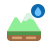

<figure><figcaption></figcaption></figure>

# TerrainMaterial

**Inherits:** [Instance](./Instance.md)

## Properties

### Slot

**Type:** `number`

Documentation for this property is not yet available.

### SurfaceType

**Type:** [TerrainSurfaceType](../enums/TerrainSurfaceType.md)

Documentation for this property is not yet available.

### Surface

**Type:** [PartMaterial](../enums/PartMaterial.md)

Documentation for this property is not yet available.

### Color

**Type:** [Color](./Color.md)

Documentation for this property is not yet available.

### AlbedoTexture

**Type:** [ImageAsset](./ImageAsset.md)

Documentation for this property is not yet available.

### NormalTexture

**Type:** [ImageAsset](./ImageAsset.md)

Documentation for this property is not yet available.

### RoughnessTexture

**Type:** [ImageAsset](./ImageAsset.md)

Documentation for this property is not yet available.

### MetallicTexture

**Type:** [ImageAsset](./ImageAsset.md)

Documentation for this property is not yet available.

### TextureScale

**Type:** `number`

Documentation for this property is not yet available.

### Roughness

**Type:** `number`

Documentation for this property is not yet available.

### Metallic

**Type:** `number`

Documentation for this property is not yet available.

### NormalStrength

**Type:** `number`

Documentation for this property is not yet available.
