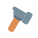

<figure><figcaption></figcaption></figure>

# Tool

**Inherits:** [RigidBody](./RigidBody.md)

## Properties

### Droppable

**Type:** `boolean`

Documentation for this property is not yet available.

### IconImage

**Type:** [ImageAsset](./ImageAsset.md)

Documentation for this property is not yet available.

### DropEquipCooldown

**Type:** `number`

Documentation for this property is not yet available.

### Holder

**Type:** [NPC](./NPC.md)

Documentation for this property is not yet available.

## Methods

### Activate()

**Returns:** `nil`

Documentation for this method is not yet available.

### Deactivate()

**Returns:** `nil`

Documentation for this method is not yet available.

### PlayAnimation(animationName)

#### Parameters

- `animationName`: `string`

**Returns:** `nil`

Documentation for this method is not yet available.

## Events

### Equipped(value)

**Type:** `PTSignal`

#### Parameters

- `value`: `any`

This event is fired when its associated action occurs.

### Unequipped(value)

**Type:** `PTSignal`

#### Parameters

- `value`: `any`

This event is fired when its associated action occurs.

### Activated(value)

**Type:** `PTSignal`

#### Parameters

- `value`: `any`

This event is fired when its associated action occurs.

### Deactivated(value)

**Type:** `PTSignal`

#### Parameters

- `value`: `any`

This event is fired when its associated action occurs.
