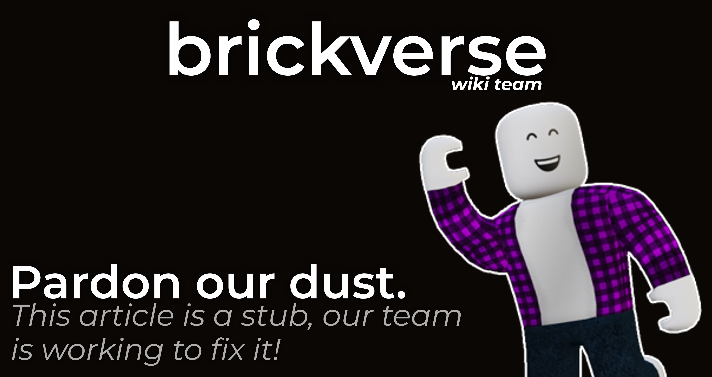

# Player Event

<figure><figcaption></figcaption></figure>

## Creating the event

We will use the PlayerConnected Event to listen when a player connects.

```lua
game.Universe.Players.PlayerConnected:Connect(function(Player)
    print(Player.Name.." says Hello to the World!");
end)
```

Here this code will now execute when a player connects and prints.

## What's returned in player?

```lua
{
    Name =  "BrickVerse", -- Username
    UserId = 1, -- UserId
    Character = -- Character
    Avatar = -- BrickThumb render
}
```
